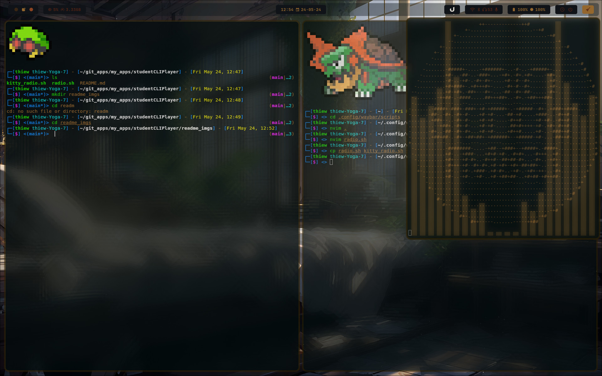
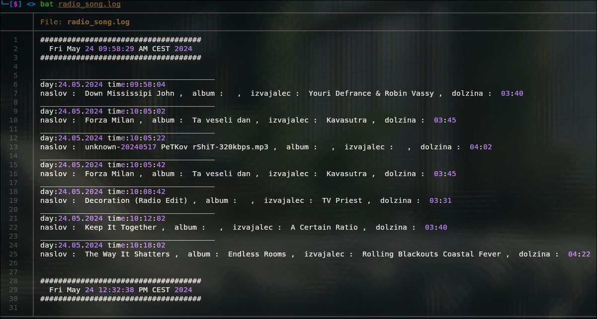

there is a problem with the display of artists/songs being played since the API changed and am waiting if i get the new one.
# studentCLIPlayer
very simple but very 【ａｅｓｔｈｅｔｉｃｈ】 Radio Študent CLI player

## preview
#### Full Hyprland integration
song display was not visible in this pic, but it is there


#### log file



## explanation
This is a very simple CLI player for Radio Študent. It is basically just a shell script that use  `mpv` to play the stream, `radio student API` to display songs and optionally `cava`. It is very simple and very basic, but it is also very 【ａｅｓｔｈｅｔｉｃｈ】.

## dependencies
- `mpv`
- `awk` and `curl` (should be installed by default)
- `cava` (optional)
- `kitty` (optional)
- `hyprland` (optional)

## usage
Just run the script. (first maybe you need to make it executable with `chmod +x radio.sh`)
the script will display the current song and artist as well as RŠ logo. It also saves the songs to a file `current_song.log` so you can can check the history of songs for the one that you really need to show to your friends.

## further integration

### `wrapper script to run cava`
You can use `cava` to display the audio spectrum. Just run `cava` in another terminal and it will display the audio spectrum. I made another wrapper script called `kitty_radio.sh` that will open `kitty` terminal with `cava` and `radio.sh` running in two different windows.

### `hyprland`
If you are using hyprland, you can put the following code in your config file to have the two windows overlap in a nice【ａｅｓｔｈｅｔｉｃｈ】way.
```hyprland.conf
windowrulev2 = float,class:(radio),title:(radio)
windowrulev2 = opacity 0.7,class:(radio),title:(radio)
windowrulev2 = size 610 700,class:(radio),title:(radio)
windowrulev2 = move 1300 60,class:(radio),title:(radio)
windowrulev2 = float,class:(visualizer),title:(visualizer)
windowrulev2 = size 610 700,class:(visualizer),title:(visualizer)
windowrulev2 = move 1300 60,class:(visualizer),title:(visualizer)
```
I am guessing there is a better way to do this, but this is the way I did it with my current knowledge of hyprland. 
**you should change the `move` and `size` values to fit your screen resolution and your preferences.**

## future development
I was thinking to add play and pause options and maybe the possibility to run in background or at least make the window smaller.
